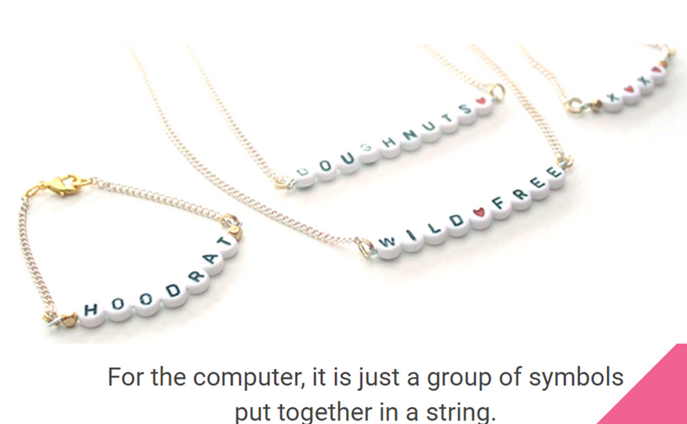
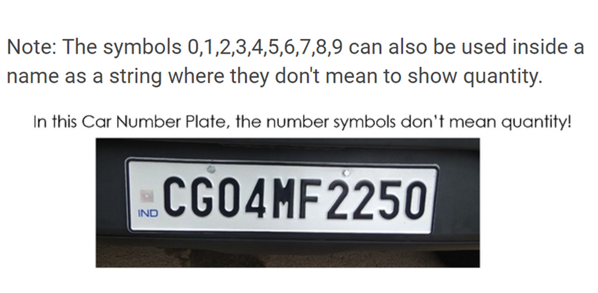
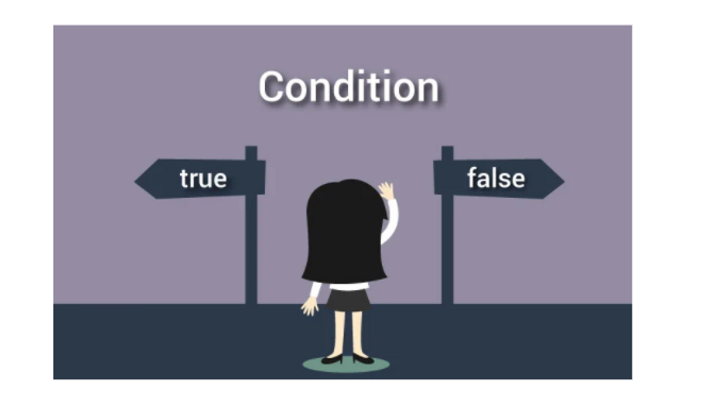
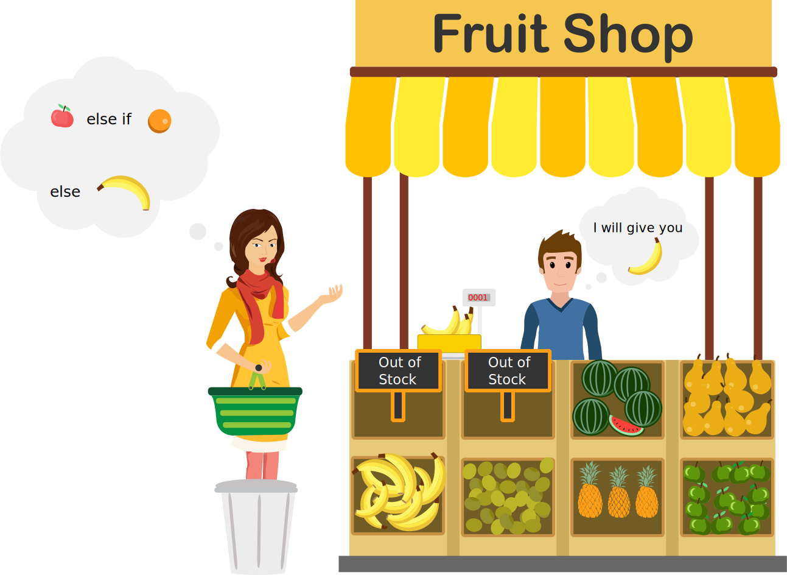
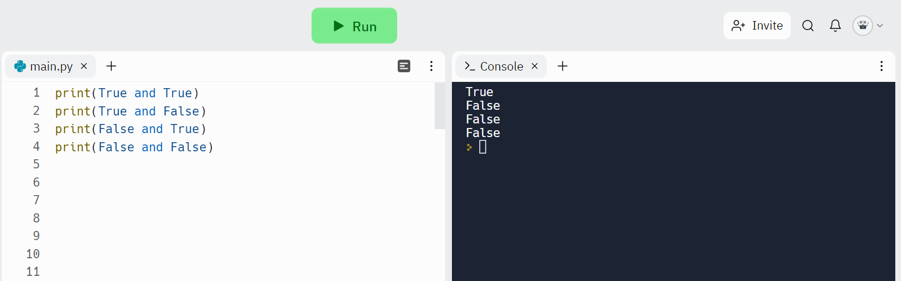
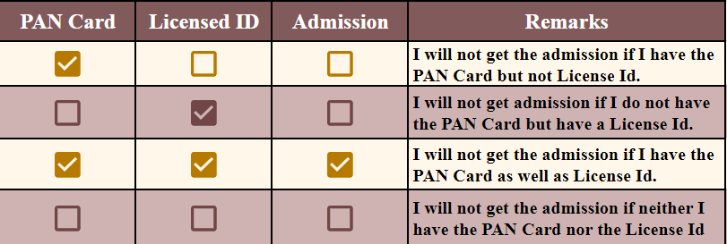
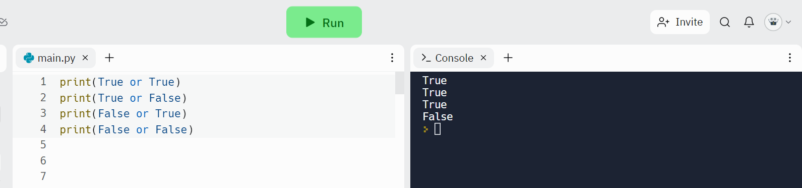
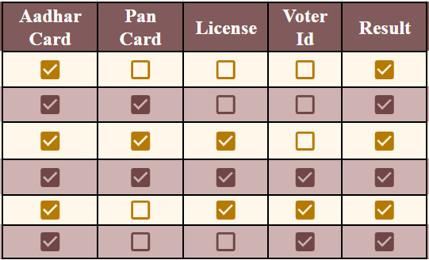
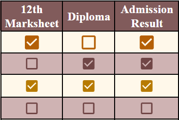

# Student Notes for Python

## Table of Contents
1. [Introduction to Python](#introduction-to-python)
2. [Operators, Conditional Statements, Ternary and Logical Operator](#conditional-statements-ternary-and-logical-operator)
---

### Student Notes for Introduction to Python & Variables, Data Types

## What is Python?

.png>)


- Python is an **interpreted**, **object-oriented**, **high-level** programming language with dynamic semantics.
- It was created by **Guido van Rossum** and released in **1991** at **CWI [Centrum Wiskunde and Informatica] Research Center, Netherlands**.


Guido van Rossum


CWI Research Center, Netherlands, Amsterdam

- It is a general-purpose language, meaning **it can be used to create a variety of different programs and isn't specialized for any specific problems.**
  - It can be used for Machine Learning and Artificial Intelligence.
  - It is the number 1 language for Data Science Projects.
  - It is popular in Web Development. Using the Django framework, you can build amazing websites.
  - Four Websites powered by **Python** & **Django**➖
    **Youtube, Spotify, Pinterest, Instagram, Dropbox**
    .png>)
  - It is used in Automation.

## Why the name Python?

- **Guido van Rossum** was reading the script of a popular BBC comedy series "**Monty Python's Flying Circus**". It was late on-air 1970s.
  
- Van Rossum wanted to select a name that said unique, sort, and mysterious. So, he decided to select naming **Python** after **"Monty Python's Flying Circus"** for their newly created programming language.
- The comedy series was **creative** and **well random**. It talks about everything. Thus, it is slow and unpredictable, which made it very interesting.

## Why Python?

- **Simple and Easy to Learn**
- **Dynamic**
- **Platform Independent**
- **Free and Open Source**
- **Interpreted (bytecode-compiled)**
- **Rich Library Support (more than 1,37,000 third-party python libraries)**
- **Embeddable and Extensible**
- **Portable**
- **Robust**
- **Exception Handling**


## How to print or get output in Python?

### **_print( )_**➖

The `print()` function prints the specified message to the screen or other standard output device.

The message can be **a string** or **any other object**, the object will be converted into a string before being written to the screen.


## **Python Comments**

- Comments can be used to explain Python code.
- They make the code more readable.
- They prevent execution when testing code.
- Comments are of two types:
  - **Single line Comment** (comments start with a #)
  - **Multiline Comment** ( place your comment inside triple quotes (’’’ ‘’’))

## Variables

Variables are containers for storing data values.

### Creating Variables

Python has no command for declaring a variable.

A variable is created when you first assign a value to it.


### Instructor Task (3 mins): Show how we can print variables and values,

Show live demo on Replit

- To know what is present inside the box, we need to use **print()**.

### Get the Type

You can get the data type of a variable with the `type()` function.


## Variables

### Instructor Task (10 mins): Talk about variables

- Let's try to understand with a story

  - There was a child who once decided to leave his home and move to a different place. He does his packing.
  - There was a lot of stuff that needs to be packed. So, What he did, He arrange some boxes and In each box, he used to put some set of things For ex: Pictures, Shoes, Shirts, pillows, books, toys, etc.
    

- For Identification, He marked each box with a name Like a box containing pictures has the name pictures, the box which contains books marked as books, etc.
- We relate this story to the concept of variables,
  - The boxes are considered as variables where you can put your set of things.
    
  - It is used to **_hold data_** that you can choose later.
  - The variable is **_storage locations with assigned names_**.

## Need of Variable

### Instructor Task (3 mins): Talk about why we need it and how is it used in real life.

- Different customers who log in to Amazon, Flipkart, or Facebook should see their name on the top, not a fixed name.
- The variable *"custName"* can be used to store the customer's name.


- It is like a box holding different values depending on who is visiting and logged in to the website.
- In the front end, Using Forms we use to take the values for different variables like Facebook signup forms carrying different variables like name, age, etc.

## Rules for Declaring Variables

- A variable name must start with a letter or underscore character ( \_ ).
- A variable name cannot start with a number.
- A variable name can only contain alphanumeric letters ( A-Z, a-z, 0-9 ) and an underscore ( \_ ).
- Variable names are case-sensitive. (age ≠ Age ≠ AGE)

## **Multi Words Variable Names**

Variable names with more than one word are difficult to read.

**Various ways by which you can use to make them more readable**:

- **Camel Case**➖ Each word, except the first, starts with a capital letter.
  Examples➖ myCar, firstPriceValue, etc.
- **Pascal Case**➖ Each word starts with a capital letter:
  Examples➖ MyCar, FirstPriceValue, etc.
- **Snake Case**➖ Each word is separated by an underscore character.
  Examples➖ my_car , first_price_value, etc.

### Instructor Task (2 mins): Introduce Data types

Apart from the customer's name,  a website may also need to know the customer's age. This would be another variable "_custAge"._

While *custAge is* also a variable but it holds a number, not a word (called a *string* in Python). Variables can have different "data types".

## Datatype

### Instructor Task (10 mins): Talk about different Data types

.png>)

As we discussed earlier, **variables are like boxes/containers**.

Above are three containers - What type of things will we store in the pencil holder? What type of things will we store in a water bottle?

Can you store milk in a basket or can you use a bottle to store fruits?

We are using different types of containers to store different things.

While the bottle can hold milk or water or juice, it will hold only liquids.

Similarly,

- A variable of type **_string_** (like the variable - *custName*), can store only strings.
- A variable of type **int** (like the variable - *custAge)* can store only integers.
- A variable of type **boolean** (like the variable - *custMaritalStatus)* can store either true or false.
- A variable of type **float** (like the variable - fruitWeight*)* can store only decimal values.

*The type of data a variable can hold is called its* **Data type**. It may be **int**, **string, boolean, float,** etc. (A variable of type Boolean can either be *True* or *False).*

## Int

.png>)

.png>)

## **String**





### Can they think of any other example like the car number plate, where a sequence of numbers is not important for their value?

One common example could be the Aadhaar card number. It is full of numbers but their “numerical value” is not how its used. We don’t say my Aadhaar number is "5 billion, 350 million …." We say it’s "5350…".

_var aadhaarNum = “535067543542”;_

vs

_var aadhaarNum = 535067543542;_

## Boolean

This datatype has only two values i.e. **True and False;**

- Some Questions are only answered in True or False :
  - For Ex :
    - Whether Student is Pass or Fail: Either True or False
    - Whether the Age is above 18 or not
- For Ex :
  - `driving = true;`
  - `smoke = false;`

### Real-World Example [5 min]

- When the user logged in to any platform like Amazon, Facebook, Gmail, etc. then the user needs to log in.
- When the user gets logged_in then in the backend the logged_in flag got true.

  - If user logged_in, then logged_in = true
  - If user logged_out , then logged_in = false

- During Shopping on the e-commerce platform. Some platform offers a 10% discount on the product only when you will use a credit card.
- Thus, the Credit card flag is set to true, only when you use a credit card.

.png>)

.png>)

### Task to print the following information [ 5 min ]

- Name
- Age
- Gender
- has_driving_license
- citizen_of_india

## Float

.png>)

.png>)

## How to declare a variable?

### Instructor Task (3 mins): Discuss how to declare a variable, Show them a live demo on Replit.

- In python, the variable is declared is as follows
  - x = 2;
  - y = "Masai";
  - z = 4.5 ;
  - w=True;
- **(CASE SENSITIVE)**
  x=2
  X=3
  X ≠ x

### **Python is a fantastic language that automatically identifies the type of data for us**.

.png>)

### Perform the task

- Give a task to create a variable of their name, age, and gender and print the type of it on Replit.

## Many Values to Multiple Variables

Python allows you to assign values to multiple variables in one line.

Ex➖

```cpp
x,y,z= "box", "pencil", "eraser"

print(x)    # box
print(z)    # pencil
print(y)    # eraser
# The number of variables matches the number of values, or else you will get an error
```

## One Value to Multiple Variables

Python allows you to assign the *same* value to multiple variables in one line.

Ex➖

```cpp
a=b=c="Maggi"
print(a)    # Maggi
print(b)    # Maggi
print(c)    # Maggi
```

## Type **Casting in Python**

Type Casting is the method to convert the variable data type into a certain data type in order to the operation required to be performed by users.

There can be two types of Type Casting in Python –

- Implicit Type Casting
- Explicit Type Casting

### Implicit Type Casting

In this, Python **converts the data type** into another data type **automatically**. In this process, users don’t have to involve in this process.

### Explicit Type Casting

In this, Python needs **user involvement to convert the variable data type** into a certain data type in order to the operation required.

Mainly type casting can be done with these data type functions:

- i**nt(): i**nt() function take float or string as an argument and return int type object.
- **float():** float() function takes int or string as an argument and returns float type object.
- **str():** str() function take float or int as an argument and return string type object.
- **bool():** str() function take float or int as an argument and return a boolean-type object.

.png>)


### Conditional Statements, Ternary and Logical Operator


Conditional statements are handled by **IF statements** in Python.



- Conditional statements are used **to decide the flow of execution based on different conditions**. If a condition is true, you can perform one action and if the condition is false, you can perform another action.
- Through Conditional Statements, we can control which code needs to run or which code will not run.
  
- Code runs based on certain conditions.
  - **For Ex:** let's understand with the analogy, the **traffic light controls the flow of vehicles on the road**. Depending upon the color of the light, the actions happened. If the light is green, then it is a signal to move whereas if the light is red then it is a signal to stop.
    
- **Based on the comparison, if the comparison is true then it will execute the one block of code otherwise another block of code.**

## Different Types of Conditional Statements

###  Discuss types of conditional Statements

There are four types of conditional statements in Python.

1. If statement
2. If…Else statement
3. If…Elif…Else statement
4. Nested If

### **if Statement**

### Discuss the if statement with examples


- It is to specify a block of Python code to be executed if a condition is true.
- **SYNTAX**➖
  ```python
  if expression:
   Statement
  ```
  Here, the program evaluates the `expression` and will execute statement(s) only if the expression is `True`.
  If the expression is `False`, the statement(s) is not executed.
- In Python, the body of the `if` statement is indicated by the indentation. The body starts with an indentation and the first unindented line marks the end.
- Python interprets non-zero values as `True`. `None` and `0` are interpreted as `False`.

### Discuss the if statement with 3 scenarios: with Boolean Value, with Expression, and with Variables

### a) If with Boolean Value

```python
print("Code Start")
if True:
    print("Inside Code")
print("Code End")
```

### b) If with Expression

- The decision is based on the value of Expression

For Example :

```python
if(5>3):
  print("Inside Code")
```

### c) If with Variables

- The decision is based on the value of Expression

For Example :

```python
name1 = "Rahul";
name2 = "Rahul";
check = (name1==name2);

if(check):
  print("Both Names are same");
```

### **Code 1: Check Whether two numbers are equal**

```python
a = 2;
b = 3;
c = (a==b);
if(c):
  print("a and b are equal");
```

## Indentation in Python

- Indentation is a very important concept of Python because without properly indenting the Python code, you will end up seeing an **Indentation Error** and the code will not get compiled.
- Python relies on **indentation (whitespace at the beginning of a line)** to define the scope of the code. Other programming languages often use **curly brackets** for this purpose.
- It refers to adding white space before a statement to a particular block of code. In another word, all the statements with the same space to the right, belong to the same code block.
- For Ex➖
  ```python
  print("Hello Python")
  if(5>9):
    print("Yes....")
  else:
    print("No...")
  print("Bye Python")
  ```

### **if…else Statement**

### Discuss the if/else statements with real-life examples


- The `if...else` is a type of conditional statement that will execute a block of code when the condition in the `if` statement is `truthy`. If the condition is `falsy`, then the `else` the block will be executed.
- Here is a list of `falsy` values:
  - empty sequences (**lists, tuples, strings, dictionaries, sets**)
  - zero in every numeric type
  - None
  - False
- If the condition is true, then one block of code executes.
- Else another block of code executes.
- **SYNTAX➖**
  ```python
  if expression:
   Statement
  else :
   Statement
  ```

### **Code 2: Check which number is greater**

```python
a = 3;
b = 20;
if(a>b):
  print("a is greater than b");
else:
  print("a is not greater than b");
```

### **Code 3: Check Whether two names are equal or not**

```python
name1 = "Suraj";
name2 = "suraj";

if(name1==name2):
  print("Names are Equal");
else:
  print("Names are not equal");

```

### Hotel Bill Discount

### Understanding if-else with Hotel Bill Example


### **Code 4: Given total_bill, discount_start_price if you satisfy the condition Print Discount Available Otherwise print No Discount**

```python
total_bill = 699;
discount_start_price = 500;

if(total_bill>=discount_start_price):
  print("Discount Availaible");
else:
  print("No discount");
```

### **if…elif…else statement**

### **Flowchart**


- **SYNTAX➖**
  ```python
  if expression:
      Body of if
  elif expression:
      Body of elif
  else:
      Body of else
  ```
- The `elif` is short for else if. It allows us to check for multiple expressions.
- If the condition for `if` is `False`, it checks the condition of the next `elif` block and so on.
- If all the conditions are `False`, the body of else is executed.
  
- Only one block among the several `if...elif...else` blocks is executed according to the condition.
- The `if` block can have only one `else` block. But it can have multiple `elif` blocks.

### Bill and Discount

**Problem Statement:** According to the total_bill, the discount will be applied.

.png>)

**Code 5: For a Restaurant, write the program for the following total_bill > 500 Then print 10% discount total_bill > 1000 Then print 20% discount Otherwise No discount**

```python
total_bill = 799;
if(total_bill > 1000):
  print("20 % discount");
elif(total_bill > 500):
    print("10 % discount");
else:
    print("No discount")
```

### If-Elif vs if-if-if :

**Code 6: If-Elif**

- **\*My mother told me to get any one of the things from the market**

1. **If Rice is available then print Buy rice**
2. **Else If wheat is available then print buy wheat**
3. **Else If apple is available then print buy apple\*\***

```python
rice_availaible = False ;
wheat_availaible = True;
apple_availaible = True;
if(rice_availaible):
  print("Buy rice");
elif(wheat_availaible):
  print("Buy Wheat");
elif(apple_availaible):
  print("Buy apple");
else:
  print("Nothing is available");
```

**Code 7:  If - If - If**

- **\*My mother told me to get all of the things if available from the market**

1. **If Rice is available then print Buy rice**
2. **If wheat is available then print and buy wheat**
3. **If apple is available then print buy apple\*\***

```python
rice_available = True ;
wheat_available = True;
apple_available = False;

if(rice_available):
  print("Buy rice");
if(wheat_available):
  print("Buy Wheat");
if(apple_available):
  print("Buy apple");
```

### Nested if

**Code 8: Solve the Marriage Problem** ➖

**Legal Age in India Males ----> 21**

**Females ----> 18**

```python
gender = "female";
age = 21;
if(gender == "male"):
  if(age>=21):
    print("Males : get marry");
  else:
    print("Males : Can't get marry");
else:
  if(age>=18):
    print("Females : get marry");
  else:
    print("Females: Can't get marry");
```

**Code 9 : Given a char , you need to print whether the char is a vowel or not vowels : a, , i, o, u**

```python
char = "z"
if(char == "a"):
  print("vowel");
elif(char == "e"):
  print("vowel");
elif(char == "i"):
  print("vowel");
elif(char == "o"):
  print("vowel");
elif(char == "u"):
  print("vowel");
else:
  print("Not a vowel");
```

## IW Assignment

- IW assignment means I WE Assignment, here we solve some questions in the class. So, that students will get comfortable with the problems.
- In this IW Assignment, we will take some problems and work on the solution together with students

### **Problem 1: If the number is divisible by 3, print a "multiple of 3".**

```python
        number = 16;
        remainder = number % 3;
        if(remainder == 0):
            print("Multiple of 3");
        else:
            print("Not multiple of 3");
```

### **Problem 2: If a person is allowed to drive in India print "Apply for a license" or "NA".**

```python
yob = 1995;
age = 2022-yob;
print(age);
if(age >= 18):
  print("Can Apply for license");
else:
  print("NA");
```

### **Problem 3: Given 2 numbers a and b print which is greater or "both equal".**

```python
a = 10;
b = 10;
if(a>b):
  print("A is greater");
elif(b>a):
  print("B is greater");
else:
  print("Both are equal");
```

### **Problem 4: Given the stored username and password and input username and password, Print if the user can log in or not.**

```python
stored_username = "Varun";
stored_password = "varun@123";

input_user = "Varun";
input_password = "varun@123";
if(input_user == stored_username):
  if(input_password == stored_password):
    print("Valid login");
  else:
    print("Invalid Password");
else:
  print("Wrong username");
```

### **Who is your role model?**

## Ternary Operator

### **ternary operator**

- Ternary operators also known as **conditional expressions** are operators that evaluate something based on a condition being true or false.
- It was added to Python in version **2.5.**
- It simply allows testing a condition in a **single line** replacing the multiline if-else making the code compact.
- Syntax➖
  ```python
  [on_true] if [expression] else [on_false]
  ```
- For ex-
  ```python
  # to check whether a number is odd or even
  a=10;
  print("Even Number") if(a%2==0) else print("Odd Number");
  ```
- For ex-
  ```python
  a = 409
  b = 409
  print("A") if a > b else print("=") if a == b else print("B")
  ```

## Logical Operators

###  Discuss What is Logical operators.

- A **logical operator** is a symbol or word used to connect two or more expressions.
- The logical operators are important in python because they allow you to compare variables and do something based on the result of that comparison.
- **For example**, if the result of the comparison is `true`, you perform a block of code; if it’s `false`, you perform another block of code.

Whenever we need to connect two statements.

In the Last class, we learn about conditional statements, which say that if one condition is true then do X otherwise do Y.

**For Example:** In traffic lights, If the lights are green then Move and if the lights are red then Stop.

But In reality, there might be multiple conditions on which some result depends.

## Types of Logical Operators

Python provides three logical operators:

1. and
2. or
3. not

### Logical and Operator (and)

###  Discuss Logical AND operator with some examples

- In a chain of `and`, each value will be evaluated from left to right. If any of these values happen to be **false**, that value will be returned and the chain will not continue.

  

- **For Example:**

  - Suppose I need to submit some documents in Masai, and the documents are my pan card and License Id then only I will get admission. **Here**, you can observe that I will only get admission only when I have the PAN Card and License Id (Both are important).
    
    Similarly, we can have multiple conditions on which, the result is dependent.
  - If the batsman hit the ball with a bat **AND** it catches by the fielder then he will be out.
    

    ```python
    batsman_hit = False;
    Fielder_catch = False;

    if(batsman_hit and Fielder_catch):
      print("Umpire will give OUT!");
    else:
      print("NOT OUT!");
    ```

- Our Boolean operators take the input values as boolean and produce the result in boolean.
- In python, we use to denote the AND operator in this way ”**and”**.
- **Input (Boolean Value) ——and-—> Output (Boolean Value)**

### **Code 1: AND Operator**

```python
a = True;
b = True;
c = a and b;
print(c);
a = True;
b = False;
print(a and b);
a = False;
b = True;
print(a and b);
a = False;
b = False;
print(a and b);
```

### **Code 2: AND with numbers**

```python
a = 5>3;
b = 6>3;
c = a and b;
print(c);
```

### **Code 3 : if/else**

```python
# Ist Part: Without AND

if(5>3):
    if(6>3):
        print("Both are true");

 # IInd Part: With AND

if(5>3 and 6>3):
  print("Both are true");
```

### **Code 4 : Combination of multiple statements**

```python
print((5<4) and (3>1) and (2>1) and (4<1))
```

### Solve the following problem

### **Code 5 : Check whether Rahul passed or not**

```python
#For English Subject, Check whether Rahul passed or not

subject = "english";
passing_marks = 70;
rahul_marks = 75;
rahul_subject = "english";
if((rahul_subject == subject) and (rahul_marks >= passing_marks)):
    print("Rahul Passed");
else:
  print("Rahul not passed");
```

### **Code 6 : Marriage Problem**

**Gender is male and age ≥ 21 : He can marry**

**Gender is female and age ≥ 18 : She can marry**

```python
gender = "male";
age = 21;

if((gender == "male") and (age >= 21)):
    print("Male : Can Marry");
elif((gender == "female") and (age >= 18)):
  print("Female : Can Marry");
else:
    print(gender,"Can't get Marry");
```

### **Code 7 : Differentiate between ,(coma) and +**

```python
a = 2;
b = 3;
c = "hello";
print(a,b,c);
# print(a+b+c) gives error

# Case 2: Integers
d= 2;
e =3;
print(d+e);
print(d,e);

#Case 3: Strings
f = "Hello";
g = "World";
print(f+g);

#Case 4: Integer with Strings
h= 2;
i = "hello";
print(h,i);
# print(h+i);  gives error

#Case 5: "\n"
j = 2;
k = "hello";
print(j,"\n",k);
```

### **Code 8: Mom wants to make Palak Paneer, So she sends sunny to the shop to buy Palak and paneer.**

Since she asked for Palak paneer. In this case, both items Palak and paneer are required to make Palak paneer, if any of the items are not available in the shop then it is not possible to make a Palak paneer dish.


```python
palak_availaible = False;
paneer_availaible = False;

if(paneer_availaible and palak_availaible):
  print("Today, we will have a party");
else:
  print("No Party");
```

### Logical or Operator (or)

- The `or` operator behaves exactly like the `and` does, only in reverse! While a chain of `and` s will break if a falsy value is found, a chain of `or`s will break when it finds a **truthy** value. And, just like with the **`and`** s, if there are no truthy values and the end of the chain is reached, the last value in that chain is returned.
- If any of the statement is true, then the result will be true

  

- **For Example,** Drivezy is a Renting bike service Startup, If you want to rent a bike then you need to submit any of the Identity Document
  **Aadhar Card or PAN Card or License or Voter id Card**
  



      and many more cases are possible.

**Observation :**

1. If any of the cases is true then the final result will be true.
2. If all the cases are false, then only the result will be false.

- **Example**➖
  - **Masai asks for documents After Msat is in the documentation phase, either submit the 12th Mark Sheet or Diploma.**
    
    Show in Replit
  - **What do you prefer?**
    
  - **Boy want ice-cream but confused which one.**
    

### **Code 9: OR Operator**

```python
a = True;
b = True;
c = a or b;
print(c);

a = True;
b = False;
print(a or b);

a = False;
b = True;
print(a or b);

a = False;
b = False;
print(a or b);
```

### What is the output of the following

### **Code 10 : OR Operator**

1. (True or False or True)
2. (False or True or False)
3. (False or False or True)

### **Code 11: Mom wants to prepare something for dinner, and she decides that they will make Potato or Paneer, So she sends sunny to the shop to buy potato or paneer.**

Since, Either she will prepare potato or paneer for the dinner. In this case, if any of the items are available in the shop then it is possible to prepare dinner.

```python
potato_availaible = True;
paneer_availaible = False;

if(potato_availaible or paneer_availaible):
  print("Dinner : Possible");
else:
  print("Dinner : Not Possible");
```

### **Code 12: Marriage Problem**

**Male: age≥21, Female: age≥18**


```python
gender = "female";
age = 18;

if((gender == "male" and age>=21) or (gender == "female" and age>=18)):
    print(gender,": Can get Married");
else:
    print(gender,": Can't get married");
```

### Logical not Operator (not)

- On applying to a boolean value, the *not* operator turns *true* to *false* and *false* to *true*.


- For Example :
- For any website, there are multiple roles

  - Admin
  - User

  ```python
  admin_access = False;
  if(not admin_access):
    print("Access Denied");
  else:
    print("Welcome");
  ```

- The boolean NOT operator is represented with the word `**not**`.
- The operator accepts a single argument and converts it into a boolean and then **it inverses the output.**
- Example➖
  - When the umpire asks for the option of **Head or Tail.**
    **Dhoni: `not Tail`** What does he mean?
    Of course, the **Head**
    
  - **Not Friends == Enemies**
    


## IW Assignment

### **Code 13:**

```python
'''Problem 1: Given the year of birth, if the
  1. Age between 13 and 19 (both included) print Teenage and
  2. Age between 20 and 29 (both included) print Twenties'''
yob = 1996;
age = 2022-yob;
print(age);
if(age >= 13 and age <= 19):
  print("Teenage");
elif(age >= 20 and age <= 29):
  print("Twenties")
```

### **Code 14 :**

```python
# Problem 2: Given any character, if it is a vowel print "Vowel"

char = "i";
if((char == "a") or (char=="e") or (char=="i") or (char=="o") or (char=="u") ):
  print("is a vowel");
else:
  print("not a vowel");
```

### **Code 15 :**

```python
# Problem 4: Given 3 numbers (all different values), print which is the greatest

a = 15;
b = 15;
c = 15;

#a is greatest, b is greatest, c is greatest
if((a>b) and (a>c)):
  print("a is greatest");
elif((b>a) and (b>c)):
  print("b is greatest");
elif((c>a) and (c>b)):
  print("c is greatest");
else:
  print("All are equal");
```

### Code 16: Sam wants to throw a party; he calls an event organizer and gives instructions about an entry that only those people will get an entry who are belongs to the family or those who are invited.


```python
Invitation_card = False;
family_member = True;

if(Invitation_card or family_member):
    print("Allow Entry!!");
else:
    print("Not Allowed!!");
```

**Happy Coding!**


